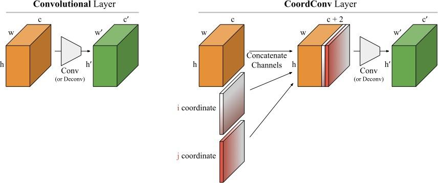

# Coordinate Convolution (Pytorch implementation)
Given a very simple task of predicting the (i,j)th coordinate of a single pixel on a black background, convolutional nets fail.
Uber AI propose a simple solution of adding the i^{th} and j^{th} coordinate as additional channels to each input tensor.

The image below (taken from https://eng.uber.com/coordconv/) shows how this is implemented.

